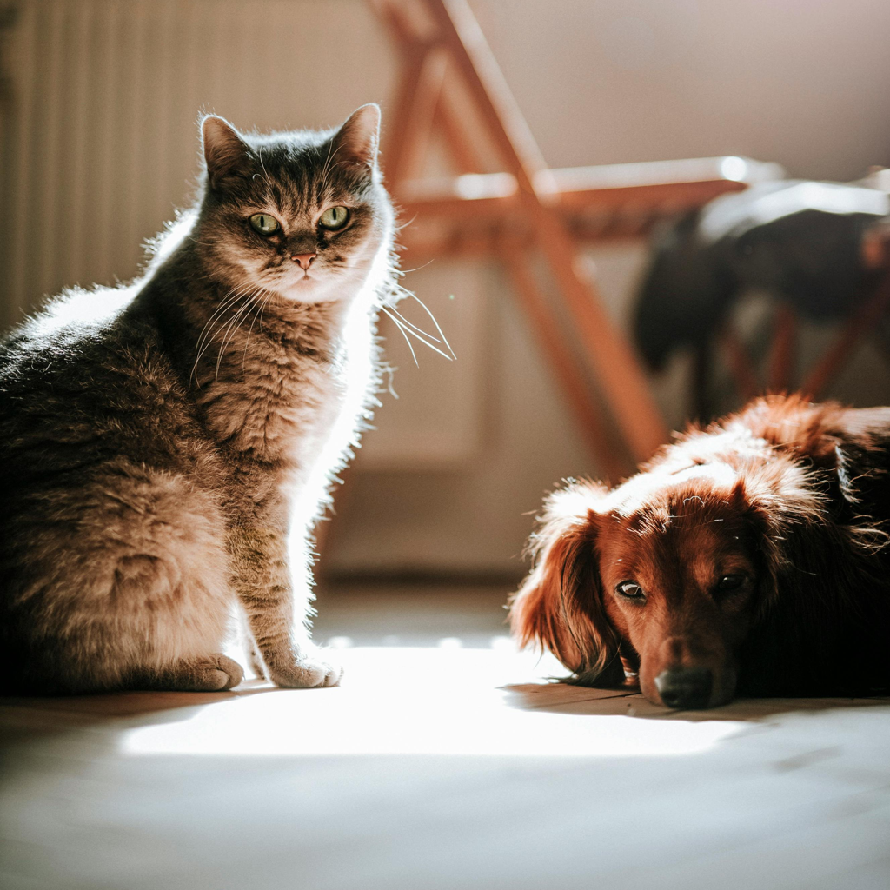
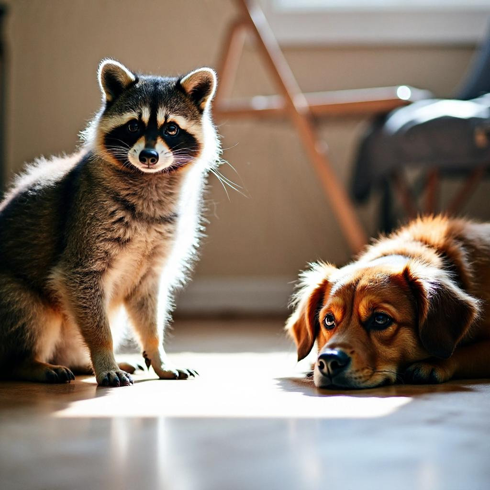
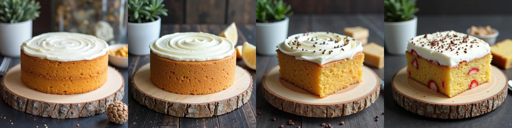
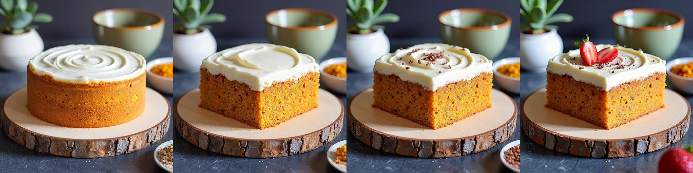

# Rectified Flow Image Editing Approaches

Welcome to the **Rectified Flow Image Editing** repository!  
This project provides a unified implementation of multiple *Rectified Flow (RF)*-based image editing approaches built upon the [🤗 Diffusers](https://github.com/huggingface/diffusers) library.  
It aims to make experimentation, comparison, and exploration of RF editing techniques both **reproducible** and **accessible**.

---

## 🚀 Features

This repository includes several state-of-the-art RF-based editing methods, all implemented under a consistent Diffusers interface:

- [RF-Inversion](https://arxiv.org/abs/2410.10792) · *ICLR 2024*
- [RF-Solver](https://arxiv.org/abs/2411.04746) · *ICML 2025*
- [FireFlow](https://arxiv.org/abs/2412.07517) · *ICML 2025*
- [FTEdit](https://arxiv.org/abs/2412.07517) · *CVPR 2025*
- [FlowEdit](https://arxiv.org/abs/2412.08629) · *ICCV 2025*
- [MultiTurn](https://arxiv.org/abs/2505.04320) · *ICCV 2025*
- [DNAEdit](https://arxiv.org/abs/2506.01430) · *NeurIPS 2025*

In addition, we provide two auxiliary functions, **reconstruction** and **multi-turn editing**, to enhance usability and evaluation:

- **Reconstruction**: Evaluates each method’s inversion and reconstruction capability.  
- **Multi-turn Editing**: Tests editing consistency across multiple sequential edits.

---

## ⚙️ Installation

Set up the environment with:

```bash
uv sync
source .venv/bin/activate
````

---

## 📘 Example Usage

For detailed examples, refer to the notebooks in the `notebook/` directory.
Below is a quick example using **RF-Solver**:

```python
import diffusers
import torch

from pipeline import RFSolverEditFluxPipeline

diffusers.utils.logging.set_verbosity_error()

pipe = RFSolverEditFluxPipeline.from_pretrained("black-forest-labs/FLUX.1-dev", torch_dtype=torch.bfloat16)
pipe.to("cuda")
pipe.add_processor(after_layer=20, filter_name="single_transformer_blocks")

source_img = "assets/sources/cartoon.jpg"
source_prompt = "a cartoon style boy raising his left hand"
target_prompt = "a cartoon style Harry Potter raising his left hand"

image = pipe(
    source_img,
    source_prompt,
    target_prompt,
    inject_step=2,
    guidance_scale=2,
    num_inference_steps=25,
    with_second_order=True,
).images[0]
image.save("assets/results/cartoon_rf_solver.jpg")
image
```

---

## 🧩 Visual Comparisons

Below are several examples demonstrating different editing approaches:

> [!NOTE]
> Although some papers do not include a prompt (i.e., use a *null prompt*) for inversion,  
> all examples below adopt a **source prompt**, as we find it leads to noticeably better results.
<table align="center" style="text-align:center;">
  <thead>
    <tr>
      <th>Approach</th>
      <th>Source</th>
      <th>Edit Result</th>
    </tr>
  </thead>
  <tbody>
    <tr>
      <td rowspan="2"> RF-Inversion <br>
        <a href="notebook/demo_rf_inversion.ipynb" target="_blank">
          
        </a>
      </td>
      <td>
        
      </td>
      <td>
        
      </td>
    </tr>
    <tr>
      <td>portrait of a cat</td>
      <td>portrait of a tiger</td>
    </tr>
    <tr>
      <td rowspan="2"> RF-Solver <br>
        <a href="notebook/demo_rf_solver.ipynb" target="_blank">
          
        </a>
      </td>
      <td>
        
      </td>
      <td>
        
      </td>
    </tr>
    <tr>
      <td>a cartoon style boy raising his left hand</td>
      <td>a cartoon style Harry Potter raising his left hand</td>
    </tr>
    <tr>
      <td rowspan="2"> FireFlow <br>
        <a href="notebook/demo_fireflow.ipynb" target="_blank">
          
        </a>
      </td>
      <td>
        
      </td>
      <td>
        
      </td>
    </tr>
    <tr>
      <td>A young boy riding a brown horse in a countryside field.</td>
      <td>A young boy riding a camel in a countryside field.</td>
    </tr>
    <tr>
      <td rowspan="2"> FTEdit <br>
        <a href="notebook/demo_ftedit.ipynb" target="_blank">
          
        </a>
      </td>
      <td>
        
      </td>
      <td>
        
      </td>
    </tr>
    <tr>
      <td>a cup of coffee with a tulip latte art on a wooden table</td>
      <td>a cup of coffee with a lion latte art on a wooden table</td>
    </tr>
    <tr>
      <td rowspan="2"> FlowEdit <br>
        <a href="notebook/demo_flowedit.ipynb" target="_blank">
          
        </a>
      </td>
      <td>
        
      </td>
      <td>
        
      </td>
    </tr>
    <tr>
      <td>A gray cat and a brown dog sitting on the floor.</td>
      <td>A raccoon and a brown dog sitting on the floor.</td>
    </tr>
    <tr>
      <td rowspan="2"> DNAEdit <br>
        <a href="notebook/demo_dnaedit.ipynb" target="_blank">
          
        </a>
      </td>
      <td>
        
      </td>
      <td>
        
      </td>
    </tr>
    <tr>
      <td>A gray cat and a brown dog sitting on the floor.</td>
      <td>A raccoon and a brown dog sitting on the floor.</td>
    </tr>
  </tbody>
</table>

---

## 🔁 Reconstruction

Since many of these approaches also focus on improving **inversion quality**, we provide a dedicated example in the [inversion test notebook](notebook/inversion_test.ipynb).  

The figure below shows the **reconstruction loss** between the forward and inverted processes over 25 steps.


---

## 🎨 Multi-turn Editing

As **multi-turn image editing** becomes increasingly important for refining and controlling generation results, we provide built-in support for multi-turn editing within our framework.

The example below demonstrates how each approach performs across multiple sequential edits.
<table>
  <thead>
    <tr>
      <th>Source</th>
      <th>Editing Prompts</th>
    </tr>
  </thead>
  <tbody>
    <tr>
      <td rowspan="5">
        
      </td>
      <td>"a round cake with frosting on a wooden plate besides a cup"</td>
    </tr>
    <tr>
      <td>"a round cake with frosting on a wooden plate"</td>
    </tr>
    <tr>
      <td>"a square cake with frosting on a wooden plate"</td>
    </tr>
    <tr>
      <td>"a square cake with frosting and chocolate sprinkles on a wooden plate"</td>
    </tr>
    <tr>
      <td>"a square cake with frosting, chocolate sprinkles, and strawberry slices on a wooden plate"</td>
    </tr>
  </tbody>
</table>

| Approach     | Result |
| ------------- | ------- |
| **RF-Inversion** |  |
| **RF-Solver**    |  |
| **FireFlow**     |  |
| **FTEdit**       |  |
| **FlowEdit**     |  |
| **MultiTurn** |  |
| **DNAEdit**      |  |

---

## 💡 Remarks

The effectiveness of **image editing** largely depends on two key aspects:

- Designing better **feature replacement or addition** strategies  
- Developing more accurate **solvers for the Rectified Flow (RF)** process  

For the first aspect, researchers are encouraged to explore the [`processors`](processors/) folder.  
For the second, refer to the [`pipeline`](pipeline/) folder, particularly the `denoise` function.

---

## 📚 Citation

If you find this repository useful for your research or applications, please consider giving it a star 🌟 and also cite the corresponding original works:

<details>
<summary>RF-Inversion</summary>

```bibtex
@inproceedings{rout2024semantic,
  title={Semantic Image Inversion and Editing using Rectified Stochastic Differential Equations},
  author={Rout, Litu and Chen, Yujia and Ruiz, Nataniel and Caramanis, Constantine and Shakkottai, Sanjay and Chu, Wen-Sheng},
  booktitle={ICLR},
  year={2024}
}
```

</details>

<details>
<summary>RF-Solver</summary>

```bibtex
@inproceedings{wang2025taming,
  title={Taming Rectified Flow for Inversion and Editing},
  author={Wang, Jiangshan and Pu, Junfu and Qi, Zhongang and Guo, Jiayi and Ma, Yue and Huang, Nisha and Chen, Yuxin and Li, Xiu and Shan, Ying},
  booktitle={ICML},
  year={2025}
}
```

</details>

<details>
<summary>FireFlow</summary>

```bibtex
@inproceedings{deng2025fireflow,
  title={FireFlow: Fast Inversion of Rectified Flow for Image Semantic Editing},
  author={Deng, Yingying and He, Xiangyu and Mei, Changwang and Wang, Peisong and Tang, Fan},
  booktitle={ICML},
  year={2025}
}
```

</details>

<details>
<summary>FTEdit</summary>

```bibtex
@inproceedings{xu2025unveil,
  title={Unveil inversion and invariance in flow transformer for versatile image editing},
  author={Xu, Pengcheng and Jiang, Boyuan and Hu, Xiaobin and Luo, Donghao and He, Qingdong and Zhang, Jiangning and Wang, Chengjie and Wu, Yunsheng and Ling, Charles and Wang, Boyu},
  booktitle={CVPR},
  pages={28479--28489},
  year={2025}
}
```

</details>

<details>
<summary>FlowEdit</summary>

```bibtex
@inproceedings{kulikov2025flowedit,
  title={FlowEdit: Inversion-free text-based editing using pre-trained flow models},
  author={Kulikov, Vladimir and Kleiner, Matan and Huberman-Spiegelglas, Inbar and Michaeli, Tomer},
  booktitle={ICCV},
  year={2025}
}
```

</details>

<details>
<summary>MultiTurn</summary>

```bibtex
@inproceedings{zhou2025multi,
  title={Multi-turn Consistent Image Editing},
  author={Zhou, Zijun and Deng, Yingying and He, Xiangyu and Dong, Weiming and Tang, Fan},
  booktitle={ICCV},
  year={2025}
}
```

</details>

<details>
<summary>DNAEdit</summary>

```bibtex
@inproceedings{xie2025dnaedit,
  title={DNAEdit: Direct Noise Alignment for Text-Guided Rectified Flow Editing},
  author={Xie, Chenxi and Li, Minghan and Li, Shuai and Wu, Yuhui and Yi, Qiaosi and Zhang, Lei},
  booktitle={NeurIPS},
  year={2025}
}
```

</details>

---

## 🙏 Acknowledgements

We sincerely thank the authors of all referenced papers for open-sourcing their work. This project builds upon their valuable contributions and integrates them into a unified, Diffusers-compatible framework.
